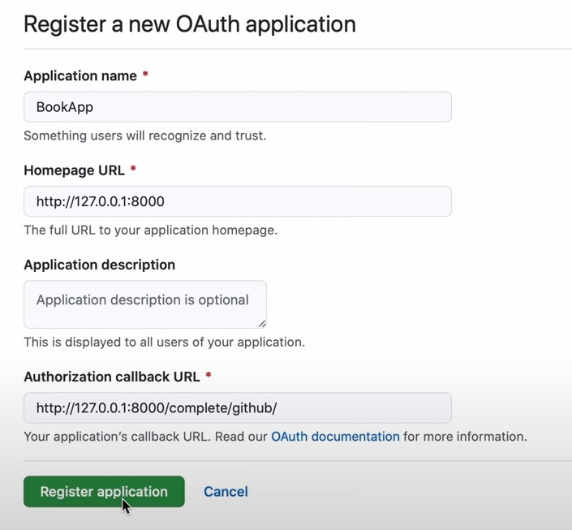

# Книги DRF

***

## Описание

Приложение докерезировано и покрыто тестами.

На сайте реализован следующий функционал:
* Вход на сайт через GitHub (настройка в разделе _дополнительные возможности_)

---

## Окружение проекта:
  * Python 3.8
  * Django 3
  * БД PostgreSQL
  * DRF

---

## Запуск

Склонируйте репозиторий с помощью git

    https://github.com/ChebuRashkaRF/DRF_book.git

Перейти в папку:
```bash
cd books
```

В терминале необходимо прописать следующую команду для сбора нового образа и запуска контейнеров:

```bash
docker-compose up --build
```

Чтобы использовать Базу данных с тестовыми данными, необходимо в новом терминале прописать следующую команду

```bash
docker exec -i db_book psql -U dj_user_books dj_books < ./backup_db/dj_books_backup.dump
```

В этом случае доступен _супер пользователь_:
* Логин: admin111
* Пароль: 1234

---

## Дополнительные возможности

Для того чтобы на сайте работал весь функционал, необходимо выполнить следующие действия.


1. Чтобы работал вход на сайт через GitHub, необходимо создать приложение на сайте _https://github.com/settings/applications/new_. Прописать настройки как на изображении:  Затем в файле _.env.dev_ указать значения переменным: SOCIAL_AUTH_GITHUB_KEY, SOCIAL_AUTH_GITHUB_SECRET.
